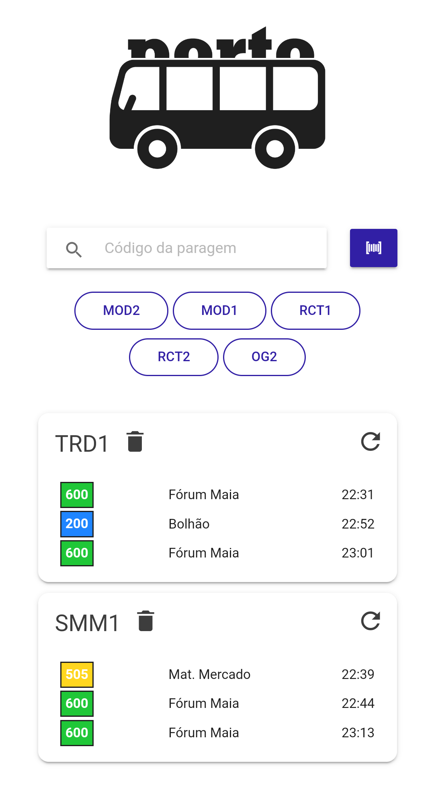

# AutoPorto - Android [](https://travis-ci.com/randrade23/AutoPorto-Android)

_Os horários da STCP em tempo real, no seu bolso_

<a href='https://play.google.com/store/apps/details?id=pt.ruiandrade.autoporto&pcampaignid=pcampaignidMKT-Other-global-all-co-prtnr-py-PartBadge-Mar2515-1'></a>

## A aplicação

<p align="center">
  
</p>

* Listagem automática das paragens próximas (~500 metros) com base na localização
* Histórico de paragens pesquisadas
* Leitor de código de barras / código QR para ler paragem a partir da folha de horários
* Design simples onde é possível ao utilizador obter imediatamente a informação de uma paragem, sem menus adicionais

## Como compilar

* Node.js v10.19.0
* Ionic v5.0.0
* Android SDK v28

```bash
npm install -g ionic cordova
npm install
ionic cordova build android
```

## Licença

GPL v3

## Legal

_Google Play e o logótipo do Google Play são marcas comerciais da Google LLC_
